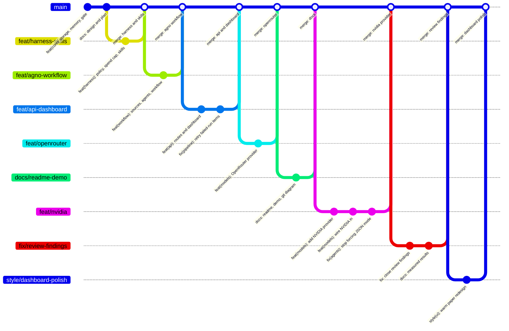

# Git history

Each milestone was built on its own branch and merged into `main` with a merge commit.

```mermaid
gitGraph
    commit id: "feat(core): storage, memory, gate"
    commit id: "docs: design and plan"
    branch feat/harness-skills
    commit id: "feat(harness): policy, spend cap, skills"
    checkout main
    merge feat/harness-skills id: "merge: harness and skills"
    branch feat/agno-workflow
    commit id: "feat(workflow): sources, agents, workflow"
    checkout main
    merge feat/agno-workflow id: "merge: agno workflow"
    branch feat/api-dashboard
    commit id: "feat(api): routes and dashboard"
    commit id: "fix(pipeline): retry failed-run items"
    checkout main
    merge feat/api-dashboard id: "merge: api and dashboard"
    branch feat/openrouter
    commit id: "feat(models): OpenRouter provider"
    checkout main
    merge feat/openrouter id: "merge: openrouter"
    branch docs/readme-demo
    commit id: "docs: readme, demo, git diagram"
    checkout main
    merge docs/readme-demo id: "merge: docs"
    branch feat/nvidia
    commit id: "feat(models): add NVIDIA provider"
    commit id: "feat(models): wire NVIDIA in"
    commit id: "fix(agents): stop forcing JSON mode"
    checkout main
    merge feat/nvidia id: "merge: nvidia provider"
    branch fix/review-findings
    commit id: "fix: close review findings"
    commit id: "docs: measured results"
    checkout main
    merge fix/review-findings id: "merge: review findings"
    branch style/dashboard-polish
    commit id: "style(ui): warm paper redesign"
    checkout main
    merge style/dashboard-polish id: "merge: dashboard polish"
```
